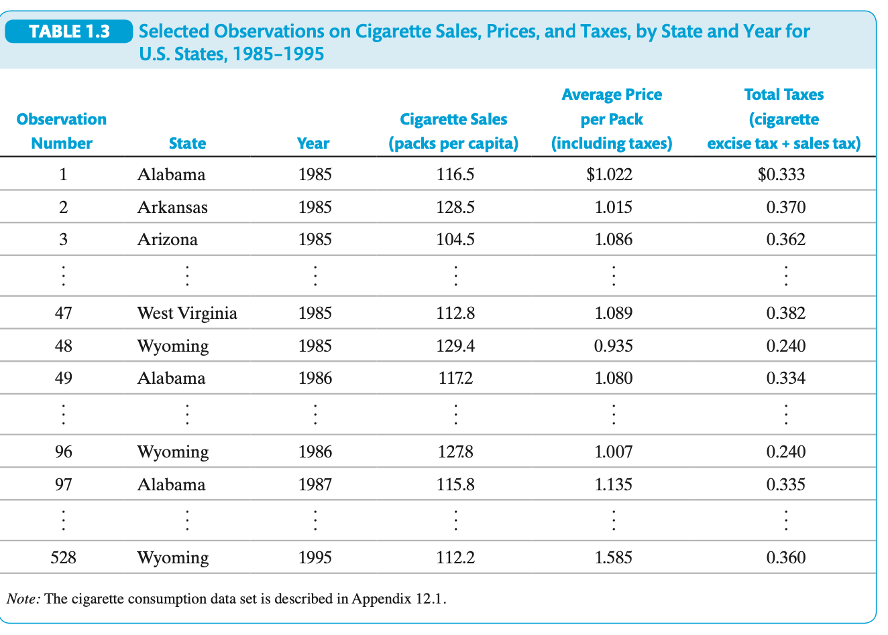

Economic Questions and Data

C H A P T E R 

1

Ask a half dozen econometricians what econometrics is, and you could get a half 

dozen different answers. One might tell you that econometrics is the science of 

testing economic theories. A second might tell you that econometrics is the set of 
tools used for forecasting future values of economic variables, such as a firm’s sales, the 
overall growth of the economy, or stock prices. Another might say that econometrics is 
the process of fitting mathematical economic models to real-world data. A fourth 
might tell you that it is the science and art of using historical data to make numerical, 
or quantitative, policy recommendations in government and business.

In fact, all these answers are right. At a broad level, econometrics is the science 
and art of using economic theory and statistical techniques to analyze economic data. 
Econometric methods are used in many branches of economics, including finance, 
labor economics, macroeconomics, microeconomics, marketing, and economic policy. 
Econometric methods are also commonly used in other social sciences, including 
political science and sociology.

This text introduces you to the core set of methods used by econometricians. We 
will use these methods to answer a variety of specific, quantitative questions from the 
worlds of business and government policy. This chapter poses four of those questions 
and discusses, in general terms, the econometric approach to answering them. The 
chapter concludes with a survey of the main types of data available to econometri-
cians for answering these and other quantitative economic questions.

1.1  Economic Questions We Examine

Many decisions in economics, business, and government hinge on understanding rela-
tionships among variables in the world around us. These decisions require quantita-
tive answers to quantitative questions.

This text examines several quantitative questions taken from current issues in 
economics. Four of these questions concern education policy, racial bias in mortgage 
lending, cigarette consumption, and macroeconomic forecasting.

Question #1: Does Reducing Class Size Improve 
Elementary School Education?
Proposals for reform of the U.S. public education system generate heated debate. 
Many of the proposals concern the youngest students, those in elementary schools. 
Elementary school education has various objectives, such as developing social skills, 

43

M01_STOC4455_04_GE_C01.indd   43

26/11/18   1:28 PM

 
44 

CHAPTER 1  Economic Questions and Data

but for many parents and educators, the most important objective is basic academic 
learning:  reading,  writing,  and  basic  mathematics.  One  prominent  proposal  for 
improving basic learning is to reduce class sizes at elementary schools. With fewer 
students in the classroom, the argument goes, each student gets more of the teacher’s 
attention,  there  are  fewer  class  disruptions,  learning  is  enhanced,  and  grades 
improve.

But what, precisely, is the effect on elementary school education of reducing class 
size? Reducing class size costs money: It requires hiring more teachers and, if the 
school is already at capacity, building more classrooms. A decision maker contem-
plating hiring more teachers must weigh these costs against the benefits. To weigh 
costs and benefits, however, the decision maker must have a precise quantitative 
understanding of the likely benefits. Is the beneficial effect on basic learning of 
smaller classes large or small? Is it possible that smaller class size actually has no 
effect on basic learning?

Although common sense and everyday experience may suggest that more learn-
ing occurs when there are fewer students, common sense cannot provide a quantita-
tive answer to the question of what exactly is the effect on basic learning of reducing 
class size. To provide such an answer, we must examine empirical evidence—that is, 
evidence based on data—relating class size to basic learning in elementary schools.

In this text, we examine the relationship between class size and basic learning, 
using data gathered from 420 California school districts in 1999. In the California 
data, students in districts with small class sizes tend to perform better on standardized 
tests than students in districts with larger classes. While this fact is consistent with the 
idea that smaller classes produce better test scores, it might simply reflect many other 
advantages that students in districts with small classes have over their counterparts 
in districts with large classes. For example, districts with small class sizes tend to have 
wealthier residents than districts with large classes, so students in small-class districts 
could have more opportunities for learning outside the classroom. It could be these 
extra learning opportunities that lead to higher test scores, not smaller class sizes. 
In Part II, we use multiple regression analysis to isolate the effect of changes in class 
size  from  changes  in  other  factors,  such  as  the  economic  background  of  the 
students.

Question #2: Is There Racial Discrimination  
in the Market for Home Loans?
Most people buy their homes with the help of a mortgage, a large loan secured by the 
value of the home. By law, U.S. lending institutions cannot take race into account when 
deciding to grant or deny a request for a mortgage: Applicants who are identical in all 
ways except their race should be equally likely to have their mortgage applications 
approved. In theory, then, there should be no racial bias in mortgage lending.

In contrast to this theoretical conclusion, researchers at the Federal Reserve Bank 
of Boston found (using data from the early 1990s) that 28% of black applicants are 

M01_STOC4455_04_GE_C01.indd   44

29/11/18   10:50 AM

1.1  Economic Questions We Examine 

45

denied mortgages, while only 9% of white applicants are denied. Do these data indi-
cate that, in practice, there is racial bias in mortgage lending? If so, how large is it?

The fact that more black than white applicants are denied in the Boston Fed data 
does not by itself provide evidence of discrimination by mortgage lenders because 
the black and white applicants differ in many ways other than their race. Before 
concluding that there is bias in the mortgage market, these data must be examined 
more closely to see if there is a difference in the probability of being denied for 
otherwise identical applicants and, if so, whether this difference is large or small. To 
do so, in Chapter 11 we introduce econometric methods that make it possible to 
quantify the effect of race on the chance of obtaining a mortgage, holding constant 
other applicant characteristics, notably their ability to repay the loan.

Question #3: Does Healthcare Spending Improve 
Health Outcomes?
It is self-evident that no one lives forever, but avoidable deaths can be reduced and 
survival can be extended through the provision of healthcare. Healthcare has other 
beneficial effects too, like the improvement of the health-related quality of life of indi-
viduals. To these ends and more, a vast quantity of resources is devoted to the provision 
of healthcare worldwide. What is more there is enormous variation in the healthcare 
expenditures across countries both in absolute and per capita terms, as well as variations 
in health outcomes across countries, for example measured by life expectancy at birth.
Putting aside concerns about iatrogenesis (the idea that healthcare is bad for your 
health), basic economics says that more expenditure on healthcare should generally 
reduce avoidable mortality. But by how much? If the amount spent on healthcare 
increases by 1%, by what percentage will avoidable mortality decrease? The percent-
age change in avoidable mortality resulting from a 1% increase in healthcare expendi-
ture is the spending elasticity for mortality (analogous to the price elasticity of demand, 
which is the percentage change in quantity demanded from a 1% increase in price). If 
we want to reduce avoidable mortality, say, 20% by increasing healthcare expenditure, 
then we need to know the spending elasticity for mortality to calculate the healthcare 
expenditure increase necessary to achieve this reduction in avoidable mortality.

A number of policy objectives are based on meeting targets based on avoidable 
mortality; for example, one of the United Nations Development Programme’s sustain-
able development goals is that all countries should aim to reduce “under-5 mortality to 
at least as low as 25 per 1,000 live births.”1 But how should the goal be met: from 
expanding healthcare services or other services? And if increasing healthcare spending 
is to form part of the mix of policies, by how much will it need to increase? The answers 
to these can be obtained with estimates of the spending elasticity for mortality.

1United  Nations  Development  Programme  (UNDP),  The  Sustainable  Development  Goals  (SDGs):  
Goal 3: Good health and well-being, 2017.

M01_STOC4455_04_GE_C01.indd   45

12/12/18   11:27 AM

 
46 

CHAPTER 1  Economic Questions and Data

While economic theory, such as the production function for health, helps us ana-
lyze the mix of inputs that may lead to improved health outcomes, it does not tell us 
the actual values for parameters such as the spending elasticity for mortality. To 
estimate the value, we must examine empirical evidence about the returns to health-
care spending—either based on variations in spending across countries or within 
countries over time (or both). In other words, we need to analyze the data on how 
health outcomes and healthcare expenditures are related.

For many years economists have attempted to address this question by consider-
ing the data on healthcare expenditures and mortality rates across countries, but such 
empirical research is fraught with challenges. Two of the biggest challenges concern 
the extensive heterogeneity across countries. The first challenge is observable hetero-
geneity, which concerns factors that affect countries’ mortality rates that may also be 
associated with healthcare expenditure, for example, the income per capita of each 
country. This can be controlled for using multiple regression analysis, as described in 
Part II, since these factors are observable to the analyst. The second and more trou-
blesome challenge is the presence of unobservable heterogeneity. Unobserved fac-
tors may be important in the underlying processes determining both how decisions 
are made on how much money is spent on healthcare, and how the overall level of 
health outcome that is attained. These factors result in causality running in both 
directions—healthcare reduces mortality, but higher healthcare expenditure might 
be a response to unobserved factors, such as small natural disasters that increase 
mortality. Methods for handling this “simultaneous causality” are described in 
Chapter 12, applied to the different but conceptually similar context of estimating 
the price elasticity of cigarette demand.

Question #4: By How Much Will U.S. GDP Grow 
Next Year?
It seems that people always want a sneak preview of the future. What will sales be next 
year at a firm that is considering investing in new equipment? Will the stock market go 
up next month, and, if it does, by how much? Will city tax receipts next year cover 
planned expenditures on city services? Will your microeconomics exam next week 
focus on externalities or monopolies? Will Saturday be a nice day to go to the beach?
One aspect of the future in which macroeconomists are particularly interested is the 
growth of real economic activity, as measured by real gross domestic product (GDP), 
during the next year. A management consulting firm might advise a manufacturing cli-
ent to expand its capacity based on an upbeat forecast of economic growth. Economists 
at the Federal Reserve Board in Washington, D.C., are mandated to set policy to keep 
real GDP near its potential in order to maximize employment. If they forecast anemic 
GDP growth over the next year, they might expand liquidity in the economy by reduc-
ing interest rates or other measures, in an attempt to boost economic activity.

Professional economists who rely on numerical forecasts use econometric mod-
els to make those forecasts. A forecaster’s job is to predict the future by using the 

M01_STOC4455_04_GE_C01.indd   46

12/12/18   11:27 AM

1.2  Causal Effects and Idealized Experiments 

47

past, and econometricians do this by using economic theory and statistical techniques 
to quantify relationships in historical data.

The data we use to forecast the growth rate of GDP include past values of GDP 
and the so-called term spread in the United States. The term spread is the difference 
between long-term and short-term interest rates. It measures, among other things, 
whether investors expect short-term interest rates to rise or fall in the future. The 
term spread is usually positive, but it tends to fall sharply before the onset of a reces-
sion. One of the GDP growth rate forecasts we develop and evaluate in Chapter 15 
is based on the term spread.

Quantitative Questions, Quantitative Answers
Each of these four questions requires a numerical answer. Economic theory provides 
clues about that answer—for example, cigarette consumption ought to go down when 
the price goes up—but the actual value of the number must be learned empirically, that 
is, by analyzing data. Because we use data to answer quantitative questions, our answers 
always have some uncertainty: A different set of data would produce a different numer-
ical answer. Therefore, the conceptual framework for the analysis needs to provide both 
a numerical answer to the question and a measure of how precise the answer is.

The conceptual framework used in this text is the multiple regression model, the 
mainstay of econometrics. This model, introduced in Part II, provides a mathematical 
way to quantify how a change in one variable affects another variable, holding other 
things constant. For example, what effect does a change in class size have on test 
scores, holding constant or controlling for student characteristics (such as family 
income) that a school district administrator cannot control? What effect does your 
race have on your chances of having a mortgage application granted, holding con-
stant other factors such as your ability to repay the loan? What effect does a 1% 
increase in the price of cigarettes have on cigarette consumption, holding constant 
the income of smokers and potential smokers? The multiple regression model and 
its extensions provide a framework for answering these questions using data and for 
quantifying the uncertainty associated with those answers.

1.2  Causal Effects and Idealized Experiments

Like many other questions encountered in econometrics, the first three questions in 
Section 1.1 concern causal relationships among variables. In common usage, an action 
is said to cause an outcome if the outcome is the direct result, or consequence, of that 
action. Touching a hot stove causes you to get burned, drinking water causes you to 
be less thirsty, putting air in your tires causes them to inflate, putting fertilizer on your 
tomato plants causes them to produce more tomatoes. Causality means that a specific 
action  (applying  fertilizer)  leads  to  a  specific,  measurable  consequence  (more 
tomatoes).

M01_STOC4455_04_GE_C01.indd   47

12/12/18   11:27 AM

 
 
48 

CHAPTER 1  Economic Questions and Data

Estimation of Causal Effects
How best might we measure the causal effect on tomato yield (measured in kilo-
grams) of applying a certain amount of fertilizer, say, 100 grams of fertilizer per 
square meter?

One way to measure this causal effect is to conduct an experiment. In that exper-
iment, a horticultural researcher plants many plots of tomatoes. Each plot is tended 
identically, with one exception: Some plots get 100 grams of fertilizer per square 
meter, while the rest get none. Whether or not a plot is fertilized is determined ran-
domly by a computer, ensuring that any other differences between the plots are 
unrelated to whether they receive fertilizer. At the end of the growing season, the 
horticulturalist weighs the harvest from each plot. The difference between the aver-
age yield per square meter of the treated and untreated plots is the effect on tomato 
production of the fertilizer treatment.

This is an example of a randomized controlled experiment. It is controlled in the 
sense that there are both a control group that receives no treatment (no fertilizer) 
m2 of fertilizer). It is ran-
and a treatment group that receives the treatment (100 g
domized in the sense that the treatment is assigned randomly. This random assign-
ment eliminates the possibility of a systematic relationship between, for example, 
how sunny the plot is and whether it receives fertilizer so that the only systematic 
difference between the treatment and control groups is the treatment. If this experi-
ment is properly implemented on a large enough scale, then it will yield an estimate 
of the causal effect on the outcome of interest (tomato production) of the treatment 
(applying 100 g

m2 of fertilizer).

>

>

In this text, the causal effect is defined to be the effect on an outcome of a given 
action or treatment, as measured in an ideal randomized controlled experiment. In 
such an experiment, the only systematic reason for differences in outcomes between 
the treatment and control groups is the treatment itself.

It is possible to imagine an ideal randomized controlled experiment to answer each 
of the first three questions in Section 1.1. For example, to study class size, one can imag-
ine randomly assigning “treatments” of different class sizes to different groups of stu-
dents. If the experiment is designed and executed so that the only systematic difference 
between the groups of students is their class size, then in theory this experiment would 
estimate the effect on test scores of reducing class size, holding all else constant.

Experiments are used increasingly widely in econometrics. In many applications, 
however, they are not an option because they are unethical, impossible to execute 
satisfactorily,  too  time-consuming,  or  prohibitively  expensive.  Even  with  non-
experimental data, the concept of an ideal randomized controlled experiment is 
important because it provides a definition of a causal effect.

Prediction, Forecasting, and Causality
Although the first three questions in Section 1.1, concern causal effects, the fourth—
forecasting the growth rate of GDP—does not.

M01_STOC4455_04_GE_C01.indd   48

12/12/18   11:27 AM

1.3  Data: Sources and Types 

49

Forecasting  is  a  special  case  of  what  statisticians  and  econometricians  call 
prediction, which is using information on some variables to make a statement about 
the value of another variable. A forecast is a prediction about the value of a variable 
in the future, like GDP growth next year.

You do not need to know a causal relationship to make a good prediction. A 
good way to “predict” whether it is raining is to observe whether pedestrians are 
using umbrellas, but the act of using an umbrella does not cause it to rain.

When one has a small number of predictors and the data do not evolve over time, 
the multiple regression methods of Part II can provide reliable predictions. Predic-
tions can often be improved, however, if there is a large number of candidate predic-
tors. Methods for using many predictors are covered in Chapter 14.

Forecasts—that is, predictions about the future—use data on variables that 
evolve over time, which introduces new challenges and opportunities. As we will see 
in Chapter 15, multiple regression analysis allows us to quantify historical relation-
ships, to check whether those relationships have been stable over time, to make quan-
titative forecasts about the future, and to assess the accuracy of those forecasts.

1.3  Data: Sources and Types

In econometrics, data come from one of two sources: experiments or nonexperi-
mental  observations  of  the  world. This  text  examines  both  experimental  and 
nonexperimental data sets.

Experimental versus Observational Data
Experimental data come from experiments designed to evaluate a treatment or policy 
or to investigate a causal effect. For example, the state of Tennessee financed a large 
randomized controlled experiment examining class size in the 1980s. In that experiment, 
which we examine in Chapter 13, thousands of students were randomly assigned to 
classes of different sizes for several years and were given standardized tests annually.

The Tennessee class size experiment cost millions of dollars and required the 
ongoing cooperation of many administrators, parents, and teachers over several years. 
Because real-world experiments with human subjects are difficult to administer and 
to control, they have flaws relative to ideal randomized controlled experiments. More-
over, in some circumstances, experiments are not only expensive and difficult to 
administer but also unethical. (Would it be ethical to offer randomly selected teenag-
ers inexpensive cigarettes to see how many they buy?) Because of these financial, 
practical, and ethical problems, experiments in economics are relatively rare. Instead, 
most economic data are obtained by observing real-world behavior.

Data obtained by observing actual behavior outside an experimental setting are 
called observational data. Observational data are collected using surveys, such as 
telephone surveys of consumers, and administrative records, such as historical records 
on mortgage applications maintained by lending institutions.

M01_STOC4455_04_GE_C01.indd   49

12/12/18   11:27 AM

 
 
50 

CHAPTER 1  Economic Questions and Data

Observational data pose major challenges to econometric attempts to estimate 
causal effects, and the tools of econometrics are designed to tackle these challenges. 
In the real world, levels of “treatment” (the amount of fertilizer in the tomato exam-
ple, the student–teacher ratio in the class size example) are not assigned at random, 
so it is difficult to sort out the effect of the “treatment” from other relevant factors. 
Much of econometrics, and much of this text, is devoted to methods for meeting the 
challenges encountered when real-world data are used to estimate causal effects.

Whether the data are experimental or observational, data sets come in three 
main types: cross-sectional data, time series data, and panel data. In this text, you will 
encounter all three types.

Cross-Sectional Data
Data on different entities—workers, consumers, firms, governmental units, and so forth—
for a single time period are called cross-sectional data. For example, the data on test scores 
in California school districts are cross sectional. Those data are for 420 entities (school 
districts) for a single time period (1999). In general, the number of entities on which we 
have observations is denoted n; so, for example, in the California data set, n = 420.

The California test score data set contains measurements of several different 
variables for each district. Some of these data are tabulated in Table 1.1. Each row 
lists data for a different district. For example, the average test score for the first dis-
trict (“district 1”) is 690.8; this is the average of the math and science test scores for 
all fifth-graders in that district in 1999 on a standardized test (the Stanford Achieve-
ment Test). The average student–teacher ratio in that district is 17.89; that is, the num-
ber of students in district 1 divided by the number of classroom teachers in district 1 

<!-- annotation:table_1-1.png
TABLE 1.1 

Selected Observations on Test Scores and Other Variables for California School 
Districts in 1999

Observation (District) 

District Average 

Student–Teacher 

Expenditure per  

Percentage of Students 

Number

Test Score (fifth grade)

Ratio

1

2

3

4

5

c

418

419

420

690.8

661.2

643.6

647 .7

640.8

c

645.0

672.2

655.8

17.89

21.52

18.70

17 .36

18.67

c

21.89

20.20

19.04

Note: The California test score data set is described in Appendix 4.1.
-->

Pupil ($)

$6385

Learning English

0.0%

5099

5502

7102

5236

c

4403

4776

5993

4.6

30.0

0.0

13.9

c

24.3

3.0

5.0

M01_STOC4455_04_GE_C01.indd   50

12/12/18   11:27 AM

1.3  Data: Sources and Types 

51

is 17.89. Average expenditure per pupil in district 1 is $6385. The percentage of stu-
dents in that district still learning English—that is, the percentage of students for 
whom English is a second language and who are not yet proficient in English—is 0%.
The remaining rows present data for other districts. The order of the rows is 
arbitrary, and the number of the district, which is called the observation number, is 
an arbitrarily assigned number that organizes the data. As you can see in the table, 
all the variables listed vary considerably.

With cross-sectional data, we can learn about relationships among variables by 
studying differences across people, firms, or other economic entities during a single 
time period.

Time Series Data
Time series data are data for a single entity (person, firm, country) collected at multiple 
time periods. Our data set on the growth rate of GDP and the term spread in the United 
States is an example of a time series data set. The data set contains observations on two 
variables (the growth rate of GDP and the term spread) for a single entity (the United 
States) for 232 time periods. Each time period in this data set is a quarter of a year (the 
first quarter is January, February, and March; the second quarter is April, May, and June; 
and so forth). The observations in this data set begin in the first quarter of 1960, which is 
denoted 1960:Q1, and end in the fourth quarter of 2017 (2017:Q4). The number of obser-
vations (that is, time periods) in a time series data set is denoted T. Because there are 232 
quarters from 1960:Q1 to 2017:Q4, this data set contains T = 232 observations.

Some observations in this data set are listed in Table 1.2. The data in each row 
correspond to a different time period (year and quarter). In the first quarter of 1960, 

<!-- annotation:table_1-2.png
TABLE 1.2 

Selected Observations on the Growth Rate of GDP and the Term 
Spread in the United States: Quarterly Data, 1960:Q1–2017:Q4

Observation  

Number

Date  

GDP Growth Rate 

Term Spread 

(year: quarter)

(% at an annual rate)

(percentage points)

1

2

3

4

5

c

230

231

232

1960:Q1

1960:Q2

1960:Q3

1960:Q4

1961:Q1

c

2017:Q2

2017:Q3

2017:Q4

8.8%

−1.5

1.0

−4.9

2.7

c

3.0

3.1

2.5

0.6

1.3

1.5

1.6

1.4

c

1.4

1.2

1.2

Note: The United States GDP and term spread data set is described in Appendix 15.1.
-->

M01_STOC4455_04_GE_C01.indd   51

12/12/18   11:27 AM

 
52 

CHAPTER 1  Economic Questions and Data

for example, GDP grew 8.8% at an annual rate. In other words, if GDP had contin-
ued growing for four quarters at its rate during the first quarter of 1960, the level of 
GDP would have increased by 8.8%. In the first quarter of 1960, the long-term inter-
est rate was 4.5%, and the short-term interest rate was 3.9%; so their difference, the 
term spread, was 0.6 percentage points.

By tracking a single entity over time, time series data can be used to study the 

evolution of variables over time and to forecast future values of those variables.

Panel Data
Panel data, also called longitudinal data, are data for multiple entities in which each 
entity is observed at two or more time periods. Our data on cigarette consumption and 
prices are an example of a panel data set, and selected variables and observations in that 
data set are listed in Table 1.3. The number of entities in a panel data set is denoted n, 
and the number of time periods is denoted T. In the cigarette data set, we have observa-
tions on n = 48 continental U.S. states (entities) for T = 11 years (time periods) from 
1985 to 1995. Thus, there is a total of n * T = 48 * 11 = 528 observations.

Some data from the cigarette consumption data set are listed in Table 1.3. The 
first block of 48 observations lists the data for each state in 1985, organized alphabeti-
cally from Alabama to Wyoming. The next block of 48 observations lists the data for 

<!-- annotation:table_1-3.png
TABLE 1.3 

Selected Observations on Cigarette Sales, Prices, and Taxes, by State and Year for  
U.S. States, 1985–1995

Observation 

Number

State

1

2

3

c

47

48

49

c

96

97

c

Alabama

Arkansas

Arizona

c

West Virginia

Wyoming

Alabama

c

Wyoming

Alabama

c

528

Wyoming

Year

1985

1985

1985

c

1985

1985

1986

c

1986

1987

c

1995

Cigarette Sales 

per Pack  

Average Price  

Total Taxes  

(cigarette  

(packs per capita)

(including taxes)

excise tax + sales tax)

116.5

128.5

104.5

c

112.8

129.4

117.2

c

127.8

115.8

c

112.2

$1.022

$0.333

1.015

1.086

c

1.089

0.935

1.080

c

1.007

1.135

c

1.585

0.370

0.362

c

0.382

0.240

0.334

c

0.240

0.335

c

0.360

Note: The cigarette consumption data set is described in Appendix 12.1.
-->

M01_STOC4455_04_GE_C01.indd   52

12/12/18   11:27 AM

Cross-Sectional, Time Series, and Panel Data

•  Cross-sectional data consist of multiple entities observed at a single time 

period.

•  Time series data consist of a single entity observed at multiple time periods.

•  Panel data (also known as longitudinal data) consist of multiple entities, 

where each entity is observed at two or more time periods.

Key Terms 

53

KEY CONCEPT 

1.1 

1986, and so forth, through 1995. For example, in 1985, cigarette sales in Arkansas 
were 128.5 packs per capita (the total number of packs of cigarettes sold in Arkansas 
in 1985 divided by the total population of Arkansas in 1985 equals 128.5). The aver-
age price of a pack of cigarettes in Arkansas in 1985, including tax, was $1.015, of 
which 37 ¢ went to federal, state, and local taxes.

Panel data can be used to learn about economic relationships from the experi-
ences of the many different entities in the data set and from the evolution over time 
of the variables for each entity.

The definitions of cross-sectional data, time series data, and panel data are sum-

marized in Key Concept 1.1.

Summary

1.  Many decisions in business and economics require quantitative estimates of 

how a change in one variable affects another variable.

2.  Conceptually, the way to estimate a causal effect is in an ideal randomized 
controlled experiment, but performing experiments in economic applications 
can be unethical, impractical, or too expensive.

3.  Econometrics provides tools for estimating causal effects using either observa-
tional (nonexperimental) data or data from real-world, imperfect experiments.
4.  Econometrics also provides tools for predicting the value of a variable of 

interest using information in other, related variables.

5.  Cross-sectional data are gathered by observing multiple entities at a single 
point in time; time series data are gathered by observing a single entity at mul-
tiple points in time; and panel data are gathered by observing multiple entities, 
each of which is observed at multiple points in time.

Key Terms

randomized controlled experiment (48)
control group (48)

treatment group (48)
causal effect (48)

M01_STOC4455_04_GE_C01.indd   53

13/12/18   5:12 PM

 
54 

CHAPTER 1  Economic Questions and Data

prediction (49)
forecast (49)
experimental data (49)
observational data (49)
cross-sectional data (50)

observation number (51)
time series data (51)
panel data (52)
longitudinal data (52)

MyLab Economics Can Help You Get a Better Grade
MyLab Economics If your exam were tomorrow, would you be ready? For each 

chapter, MyLab Economics Practice Tests and Study Plan 

help you prepare for your exams. You can also find the Exercises and all Review the Concepts Questions 
available now in MyLab Economics. To see how it works, turn to the MyLab Economics spread on the 
inside front cover of this text and then go to www.pearson.com/mylab/economics.

For additional Empirical Exercises and Data Sets, log on to the Companion Website at 
www.pearsonglobaleditions.com.

Review the Concepts

1.1  Describe a hypothetical ideal randomized controlled experiment to study the 
effect of six hours of reading on the improvement of the vocabulary of high 
school students. Suggest some impediments to implementing this experiment 
in practice.

1.2  Describe a hypothetical ideal randomized controlled experiment to study the 
effect of the consumption of alcohol on long-term memory loss. Suggest some 
impediments to implementing this experiment in practice.

1.3  You are asked to study the causal effect of hours spent on employee training 
(measured in hours per worker per week) in a manufacturing plant on the 
productivity of its workers (output per worker per hour). Describe:

a.  an ideal randomized controlled experiment to measure this causal effect;

b.  an observational cross-sectional data set with which you could study this 

effect;

c.  an observational time series data set for studying this effect; and

d.  an observational panel data set for studying this effect.

M01_STOC4455_04_GE_C01.indd   54

13/12/18   1:50 PM

 
 
 
