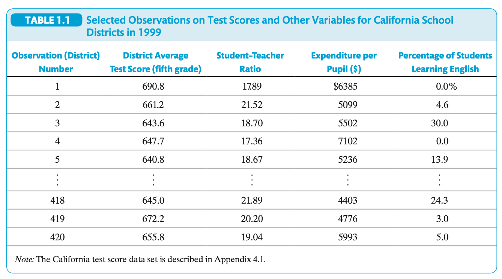
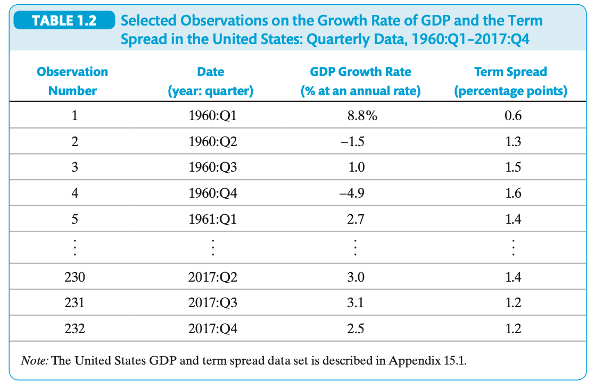
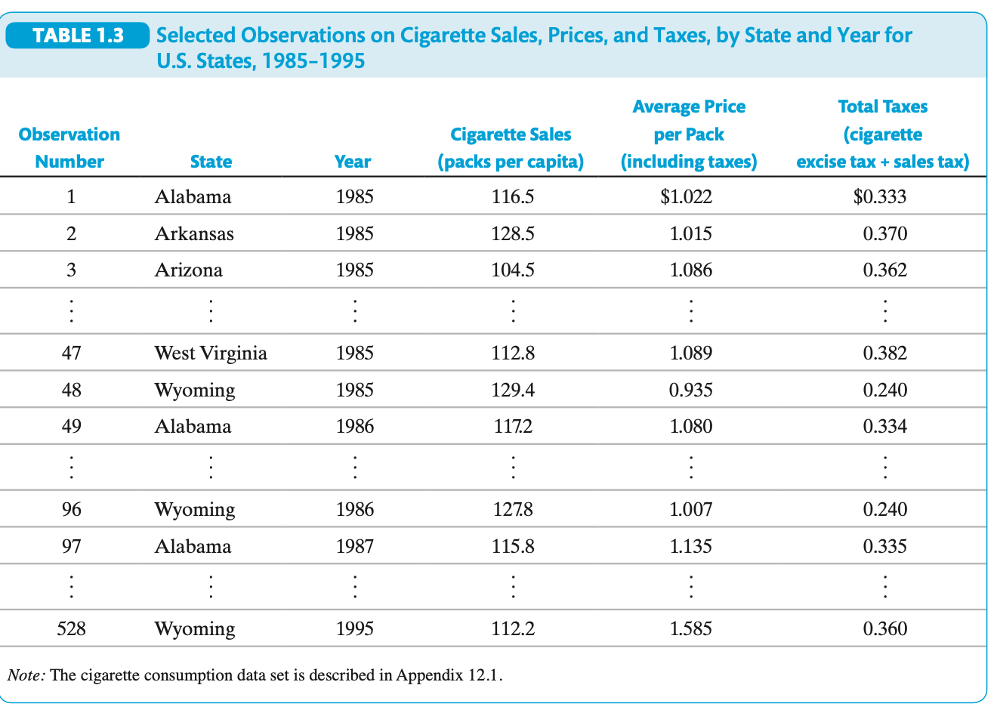

**Chapter 1: Economic Questions and Data – Explained Simply**

---

**What Is Econometrics?**

Econometrics is the use of math, statistics, and economic theory to analyze real-world data. People define it in different ways:

- Some say it's testing economic ideas with data.
- Others use it to predict things like sales or economic growth.
- It also helps fit models (math equations) to real-world behavior.
- Or make smart policy decisions based on past data.

**Bottom line:** It's about using numbers and statistical tools to understand and answer economic questions.

---

**1.1 Economic Questions We Examine**

Econometrics helps answer real-world questions like these:

**Question 1: Does Reducing Class Size Help Students Learn Better?**

The idea: smaller classes = more teacher attention = better learning.

But we can't just rely on common sense. We need data. For example:

- In 1999, California data from 420 school districts showed that smaller classes had higher test scores.
- But wealthier areas also had smaller classes—so maybe it’s wealth, not class size, causing better scores.

So, we use a tool called **multiple regression analysis** to separate the effect of class size from other factors (like income).

---

**Question 2: Is There Racial Discrimination in Mortgage Lending?**

By law, race shouldn't affect mortgage approvals.

- In Boston Fed data: 28% of Black applicants were denied vs. 9% of white applicants.
- But are they the same in other ways—like income or credit score?

We use econometrics to **control for differences** and figure out if race alone affects outcomes.

---

**Question 3: Does More Healthcare Spending Improve Health?**

- Different countries spend different amounts on healthcare.
- Some have better health outcomes (like lower child mortality).
  
To understand if spending causes better health, we look at:

- **Spending elasticity for mortality:** How much mortality drops if spending rises 1%.

But it’s tricky:

- **Observable differences** (like income) can be adjusted.
- **Unobservable differences** (like natural disasters) are harder and can confuse the cause-and-effect.

---

**Question 4: How Much Will U.S. GDP Grow Next Year?**

Economists use past data to **predict** (not explain causes) future GDP.

One important predictor: **term spread** = long-term interest rate − short-term rate.

- If term spread drops, it may signal a recession.

Econometrics helps build models to make and test these forecasts.

---

**Causal Effects and Idealized Experiments**

**Causal effect** = one thing directly causes another.

**Example:** You put fertilizer on tomato plants. More tomatoes grow.

Best way to prove cause: **randomized controlled experiment** (RCE)

- Randomly apply fertilizer to half the plots.
- Compare results with those that got none.
- If the only difference is fertilizer, then it caused the growth.

But in economics, RCEs are often too expensive or unethical (e.g., you can't randomly give people cigarettes). Still, they provide a **gold standard** to compare against.

---

**Prediction vs. Causality**

Not all questions are about causes. Some are about prediction.

**Example:** If people are carrying umbrellas, it probably means it's raining—but umbrellas don't cause rain.

So:
- **Causal analysis** needs strong evidence.
- **Prediction** only needs a pattern that works.

---

**1.3 Data: Sources and Types**

Two data types:

- **Experimental data**: from designed experiments (e.g., Tennessee's class-size study).
- **Observational data**: from real life (e.g., mortgage records, surveys).

**Three types of data formats:**

---

**Cross-Sectional Data**

- One time point
- Many entities (people, companies, schools)

**Example:** California school data from 1999

Shows:
- Test scores
- Student–teacher ratio
- Spending per student
- % of students learning English

Each row = one school district in 1999

---

**Time Series Data**

- One entity
- Across multiple time periods

**Example:** U.S. GDP and term spread from 1960 to 2017

Each row = one quarter

Shows:
- GDP growth rate
- Term spread

Used for: seeing trends and making forecasts.

---

**Panel Data (Longitudinal Data)**

- Many entities
- Each tracked over time

**Example:** Cigarette sales in all 48 U.S. states from 1985–1995

Each row = one state in one year

Shows:
- Packs sold per person
- Average price (with taxes)
- Total taxes

Panel data helps us understand both differences across states and changes over time.

---

**Key Takeaways**

1. Econometrics helps measure how one variable affects another using data.
2. Ideal experiments are the best way to prove cause and effect—but hard to do.
3. Econometrics finds causal effects using both experiments and real-world data.
4. It also helps make predictions using past patterns.
5. Data types:
   - Cross-sectional: many entities, one time
   - Time series: one entity, many times
   - Panel: many entities, many times
